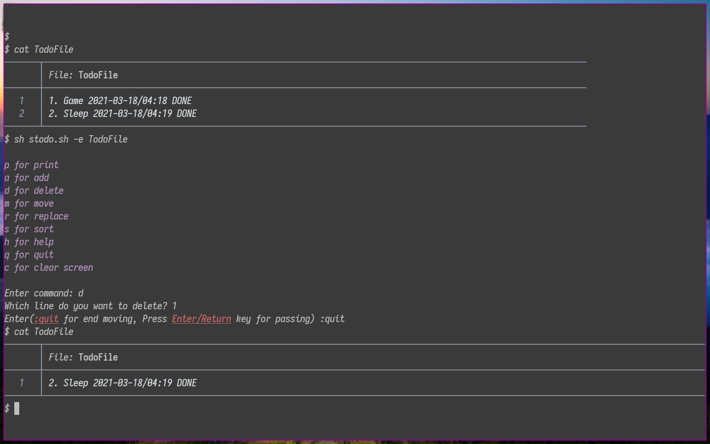
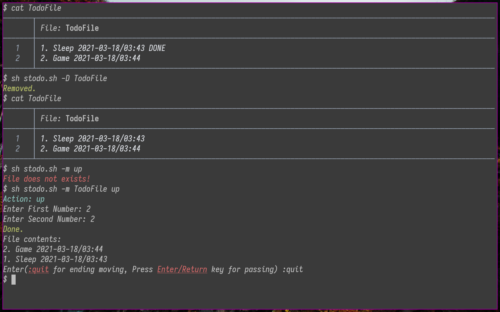
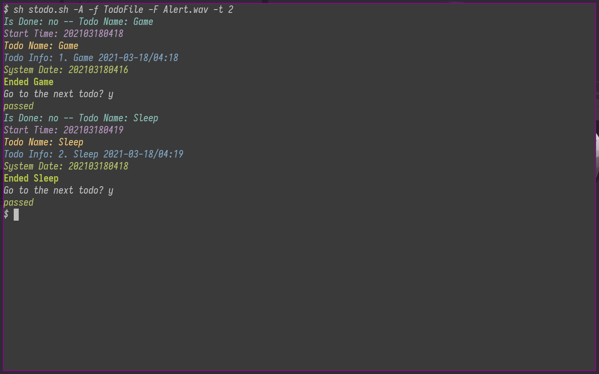

# stodo
a simple todo list script written in sh.
## Features
- Add one or X tasks/todos
- Delete task/todo
- Delete DONE word from end of lines of todo data file
- Play wav file when a todo/task is reached
- Show done or undone tasks/todos
- Add, edit, move, replace, remove todos/tasks
- Quiet and Ask mode
### Requirements
- ed(text editor)
### Installation
```
$ git clone https://github.com/Dark-Rail/stodo.git
$ cd stodo
$ sudo sh setup.sh
```
### Help
```
$ man stodo
```
### Uninstallation
```
$ cd stodo
$ sudo sh uninstall.sh
```

### Screenshots



